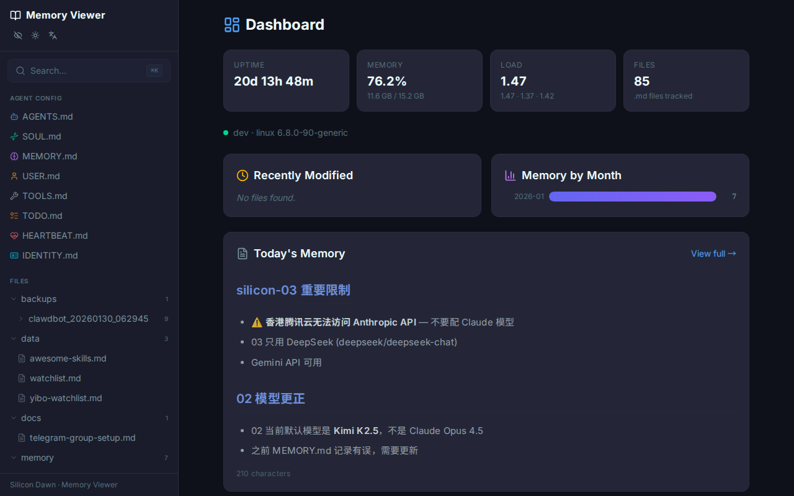
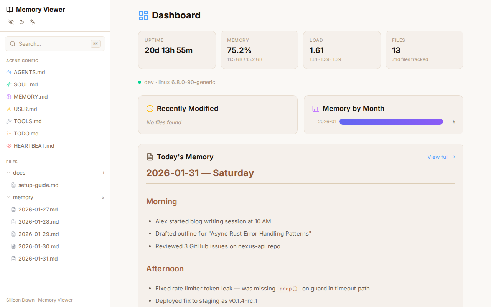
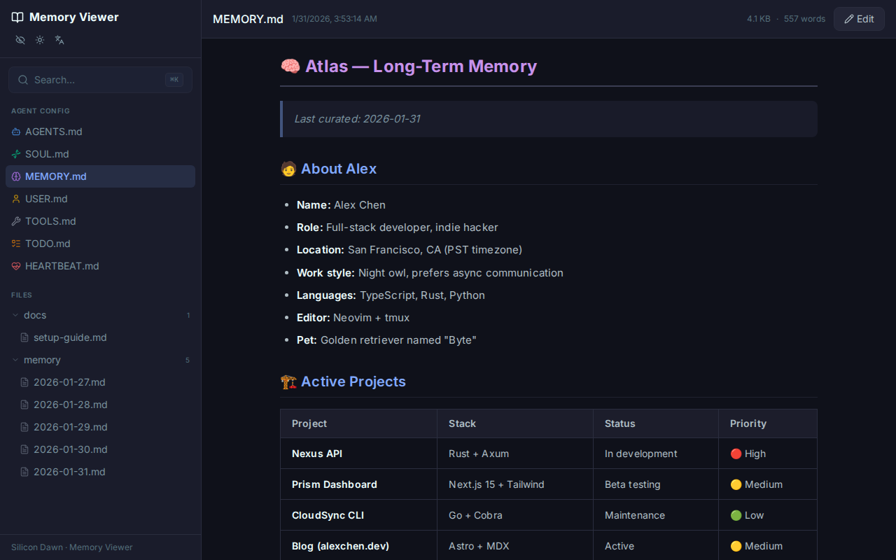
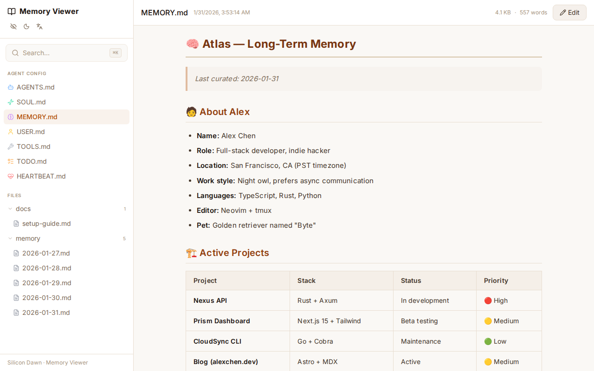
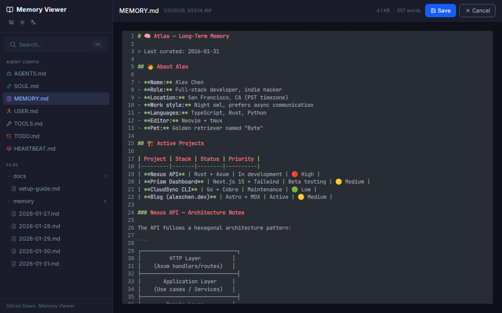
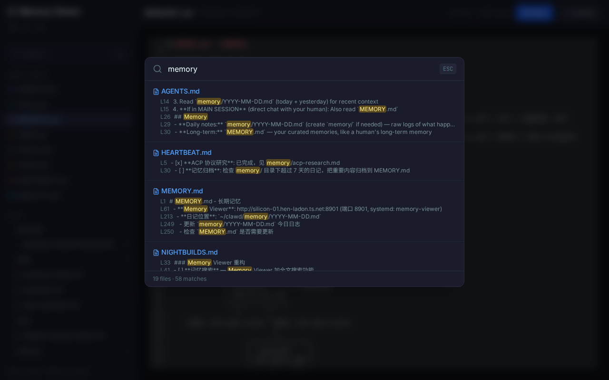

**中文** | [English](./README.md)

# 📝 Memory Viewer

[](./LICENSE)
[](https://nodejs.org/)
[](https://github.com/silicondawn/memory-viewer/releases/tag/v1.2.0)

一个精美的暗色主题 Web UI，用于浏览和编辑 AI Agent 的记忆文件。专为使用 Markdown 文件存储上下文的 [OpenClaw](https://openclaw.com) Agent 设计。

<p align="center">
  
  
</p>
<p align="center">
  
  
</p>
<p align="center">
  
  
</p>

## 功能特性

- **📁 文件树侧栏** — 可折叠的树形结构，浏览所有 `.md` 文件
- **📖 Markdown 渲染** — 支持 GFM（GitHub 风格 Markdown），包括语法高亮、表格等
- **✏️ 浏览器内编辑** — 直接在页面编辑文件，Ctrl+S 保存，支持乐观锁冲突检测
- **🔍 全文搜索** — 即时搜索所有记忆文件（Ctrl+K）
- **📊 系统仪表盘** — 服务器运行时间、内存使用、负载均值、今日记忆摘要
- **🔄 实时刷新** — 文件在磁盘上变更时自动刷新（WebSocket + 10 秒轮询兜底）
- **📱 PWA 支持** — 可安装为独立应用，支持离线缓存
- **🔗 深度链接** — 基于 Hash 路由（`#/file/路径`），可收藏和分享文件 URL
- **📊 Mermaid 图表** — 在围栏代码块中渲染流程图和各类图表
- **🚗 大屏优化** — 触控友好的 UI，适配车载屏幕（Tesla）和大型显示器
- **🌙 暗色/亮色主题** — 一键切换，适合常驻仪表盘
- **📱 响应式设计** — 移动端支持侧滑菜单
- **🌐 多 Bot 连接** — 在单个 UI 中连接多个 OpenClaw Agent 工作区

## 快速开始

```bash
# 克隆仓库
git clone https://github.com/silicondawn/memory-viewer.git
cd memory-viewer

# 安装依赖
npm install

# 启动开发服务器（同时启动 API 和 Vite）
npm run dev
```

在浏览器中打开 [http://localhost:5173](http://localhost:5173)。

## 配置

通过环境变量自定义：

| 变量 | 默认值 | 说明 |
|------|--------|------|
| `PORT` | `3001` | API 服务端口 |
| `WORKSPACE_DIR` | `~/clawd` | 包含 `.md` 文件的根目录 |
| `STATIC_DIR` | `./dist` | 前端构建产物目录 |

## 生产部署

```bash
# 构建前端
npm run build

# 启动生产服务（同时提供 API 和静态文件）
PORT=8901 npm start
```

生产服务器在单个进程中同时提供 API 和构建好的前端页面。

## 架构

```
memory-viewer/
├── server/           # Hono API + WebSocket 服务
│   └── index.ts      # 文件浏览、搜索、系统信息、实时刷新
├── src/              # React 前端（Vite + Tailwind）
│   ├── App.tsx       # 主布局 + 响应式侧栏
│   ├── api.ts        # API 客户端
│   ├── hooks/        # 自定义 React Hooks
│   │   └── useWebSocket.ts
│   └── components/
│       ├── Dashboard.tsx    # 系统概览 + 今日记忆
│       ├── FileTree.tsx     # 递归文件树导航
│       ├── FileViewer.tsx   # Markdown 渲染器 + 编辑器
│       └── SearchPanel.tsx  # 全文搜索弹窗
├── public/           # PWA manifest + 图标
└── package.json
```

**后端：** [Hono](https://hono.dev) 提供文件操作的 REST API 和基于 chokidar 的 WebSocket 文件变更通知。

**前端：** React 19 + Tailwind CSS 4 + Vite 7。使用 react-markdown 和 remark-gfm 渲染 Markdown，Mermaid 渲染图表，CodeMirror 编辑器（懒加载）。

## API 接口

| 方法 | 路径 | 说明 |
|------|------|------|
| `GET` | `/api/files` | 以树形结构列出所有 `.md` 文件 |
| `GET` | `/api/file?path=...` | 读取文件内容 + 修改时间 |
| `PUT` | `/api/file` | 保存文件（`{ path, content, expectedMtime }`） |
| `GET` | `/api/search?q=...` | 全文搜索 |
| `GET` | `/api/recent?limit=10` | 最近修改的文件 |
| `GET` | `/api/stats/monthly` | 月度文件数量分布 |
| `GET` | `/api/info` | Bot 身份信息（来自 SOUL.md / IDENTITY.md） |
| `GET` | `/api/system` | 系统信息和今日记忆 |
| `POST` | `/api/gateway/chat` | 代理聊天请求到 OpenClaw Gateway |
| `WS` | `/ws` | 文件变更实时通知 |

## 快捷键

| 快捷键 | 操作 |
|--------|------|
| `Ctrl+K` / `⌘K` | 打开搜索 |
| `Ctrl+S` / `⌘S` | 保存文件（编辑模式下） |
| `Escape` | 关闭搜索 |

## 许可证

MIT © [Silicon Dawn](https://github.com/silicondawn)
